# 🎬 Movie Ticket Booking System - System Diagrams

## 🏗️ System Architecture Overview

```mermaid
graph TB
    subgraph "Frontend Layer"
        UI[Analytics Dashboard UI<br/>HTML/CSS/JavaScript<br/>Port 8080]
    end
    
    subgraph "Backend Layer"
        API[FastAPI Server<br/>Port 8000]
        subgraph "API Modules"
            Movies[🎬 Movies API<br/>CRUD Operations]
            Theaters[🏢 Theaters API<br/>CRUD Operations]
            Halls[🎭 Halls API<br/>Layout Management]
            Seats[💺 Seats API<br/>Availability & Layout]
            Shows[🎪 Shows API<br/>Schedule Management]
            Bookings[🎫 Bookings API<br/>Individual & Group]
            Analytics[📊 Analytics API<br/>Business Intelligence]
            Users[👤 Users API<br/>Authentication]
        end
    end
    
    subgraph "Data Layer"
        DB[(SQLite Database<br/>movie_booking.db)]
        subgraph "Database Models"
            Movie[Movie<br/>id, title, genre, price]
            Theater[Theater<br/>id, name, address, city]
            Hall[Hall<br/>id, theater_id, rows, seats]
            Seat[Seat<br/>id, hall_id, row, column]
            Show[Show<br/>id, movie_id, hall_id, time]
            Booking[Booking<br/>id, user_id, show_id, seat_id]
            User[User<br/>id, email, password_hash]
        end
    end
    
    subgraph "Utility Layer"
        Utils[Booking Utilities<br/>Seat Finding<br/>Reference Generation]
        Config[Configuration<br/>Database, JWT, Settings]
    end
    
    UI -->|HTTP Requests| API
    API -->|SQL Queries| DB
    API -->|Business Logic| Utils
    Utils -->|Data Access| DB
    Config -->|Settings| API
    Config -->|Connection| DB
```



## 🗄️ Database Entity Relationship Diagram


## 🔄 API Request Flow Diagram

```mermaid
sequenceDiagram
    participant U as User
    participant UI as Analytics Dashboard
    participant API as FastAPI Server
    participant DB as SQLite Database
    participant Utils as Booking Utils
    
    Note over U,Utils: 🎫 Individual Booking Flow
    U->>API: POST /bookings/ (show_id, seat_id, user_id)
    API->>DB: Check seat availability
    API->>Utils: Generate unique booking reference
    Utils->>API: Return booking reference
    API->>DB: Create booking record
    DB->>API: Confirm booking created
    API->>U: Return booking details
    
    Note over U,Utils: 🎭 Group Booking Flow
    U->>API: POST /bookings/group (show_id, seat_ids[], user_id)
    API->>DB: Check all seats availability
    alt All seats available
        API->>Utils: Generate booking references
        Utils->>API: Return unique references
        API->>DB: Create multiple bookings
        DB->>API: Confirm all bookings
        API->>U: Return group booking success
    else Some seats unavailable
        API->>U: Return unavailable seats + alternatives
    end
    
    Note over U,Utils: 📊 Analytics Flow
    UI->>API: GET /analytics/revenue
    API->>DB: Execute revenue aggregation query
    DB->>API: Return revenue data
    API->>UI: Return JSON response
    UI->>UI: Update dashboard display
```



## 🎯 Core Features Flow


## 🚀 Deployment Architecture


## 📊 Analytics Data Flow

```mermaid
flowchart TD
    subgraph "Data Sources"
        Bookings[Booking Records]
        Shows[Show Data]
        Movies[Movie Information]
        Theaters[Theater Details]
    end
    
    subgraph "Analytics Engine"
        RevenueCalc[Revenue Calculation<br/>SUM amount_paid]
        MovieStats[Movie Statistics<br/>COUNT, AVG, GROUP BY]
        TheaterPerf[Theater Performance<br/>Revenue per theater]
        SeatUtil[Seat Utilization<br/>Booked vs Available]
    end
    
    subgraph "API Endpoints"
        RevenueAPI[/analytics/revenue]
        MovieAPI[/analytics/movie/{id}]
        TheaterAPI[/analytics/theater/{id}]
        TopMovies[/analytics/top-movies]
        TopTheaters[/analytics/top-theaters]
        SeatUtilAPI[/analytics/seat-utilization]
    end
    
    subgraph "Frontend Display"
        Dashboard[Analytics Dashboard]
        Charts[Revenue Charts]
        Tables[Data Tables]
        Summary[Summary Cards]
    end
    
    Bookings --> RevenueCalc
    Shows --> MovieStats
    Movies --> MovieStats
    Theaters --> TheaterPerf
    Bookings --> SeatUtil
    
    RevenueCalc --> RevenueAPI
    MovieStats --> MovieAPI
    TheaterPerf --> TheaterAPI
    MovieStats --> TopMovies
    TheaterPerf --> TopTheaters
    SeatUtil --> SeatUtilAPI
    
    RevenueAPI --> Dashboard
    MovieAPI --> Dashboard
    TheaterAPI --> Dashboard
    TopMovies --> Dashboard
    TopTheaters --> Dashboard
    SeatUtilAPI --> Dashboard
    
    Dashboard --> Charts
    Dashboard --> Tables
    Dashboard --> Summary
```

## 🔐 Security & Concurrency


---

## 📋 Diagram Summary

These Mermaid diagrams provide a comprehensive view of your Movie Ticket Booking System:

1. **System Architecture** - Shows the layered structure from UI to database
2. **Database ERD** - Displays all entities and their relationships
3. **API Flow** - Illustrates request/response patterns for key operations
4. **Core Features** - Maps out user journey and system workflows
5. **Deployment** - Shows development to production progression
6. **Analytics** - Demonstrates data flow for business intelligence
7. **Security** - Highlights security and concurrency measures

You can use these diagrams in your:
- 📚 Project documentation
- 🎓 Assignment submission
- 💼 Portfolio showcase
- 👥 Team presentations
- 🔧 System maintenance

The diagrams are automatically rendered by GitHub and other Markdown viewers that support Mermaid syntax.
